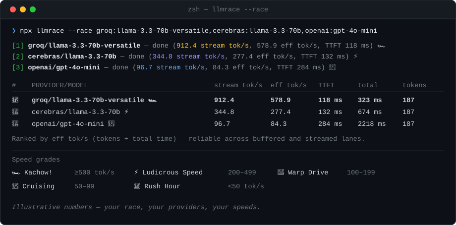

<div align="center">

# 🏁 llmrace

**Fast.com, but for LLMs.**
Race LLM providers head-to-head on tokens/sec, time-to-first-token, and total latency — right from your terminal.

[](https://www.npmjs.com/package/llmrace)
[](https://www.npmjs.com/package/llmrace)
[](package.json)
[](tsconfig.json)
[](LICENSE)
[](#contributing)

</div>

<p align="center">
  
</p>

<p align="center">
  <sub>A live fast.com-style gauge while it races, then a ranked table when it's done.</sub>
</p>

## Why llmrace

Every provider claims to be the fastest. `llmrace` lets you check, on your own prompt, from your own network, in one command — no dashboards, no vendor benchmarks to squint at.

- 🏎️ **Race providers in parallel** — same prompt, same moment, real head-to-head numbers.
- 📊 **Two throughput numbers, not one** — `stream tok/s` for raw per-token speed, `eff tok/s` (tokens ÷ total time) for a number that's still fair when a provider buffers its response instead of streaming it.
- 🎯 **Real percentiles, not one lucky run** — `--runs N` reports median/min/max so a single fast (or slow) request doesn't fool you.
- 🧭 **No-flags wizard** — run `npx llmrace` with nothing else and pick providers, models, and API keys interactively.
- 🔌 **13 providers out of the box** — OpenAI, Anthropic, Groq, Cerebras, Fireworks, Mistral, OpenRouter, Google, x.ai, z.ai, Meta, Kimi, plus any OpenAI-compatible local server (Ollama, LM Studio, llama.cpp…).
- 🤖 **Scriptable** — `--json` for CI, dashboards, or your own leaderboard.

## Table of Contents

- [Quick Start](#quick-start)
- [Installing](#installing)
- [Setting Your API Key](#setting-your-api-key)
- [Usage](#usage)
- [Options](#options)
- [Supported Providers](#supported-providers)
- [Speed Grades](#speed-grades)
- [Adding a Provider](#adding-a-provider)
- [Testing](#testing)
- [Contributing](#contributing)
- [License](#license)

## Quick Start

Every provider needs an API key except `local` (Ollama). Groq has a free tier, so it's the fastest way to try llmrace — grab a key at [console.groq.com/keys](https://console.groq.com/keys), then:

```bash
export GROQ_API_KEY=your-key-here
npx llmrace --provider groq --model llama-3.3-70b-versatile
```

No key handy yet? Skip straight to the wizard below, or run `npx llmrace --provider local --model llama3` against a local [Ollama](https://ollama.com) install — no key needed.

Race two or more providers on the same prompt:

```bash
npx llmrace --race groq:llama-3.3-70b-versatile,openai:gpt-4o-mini
```

Run it a few times and get median/min/max stats:

```bash
npx llmrace --provider groq --model llama-3.3-70b-versatile --runs 5
```

Or just run it with nothing — an interactive wizard walks you through provider, model, and API key:

```bash
npx llmrace
```

## Installing

<details>
<summary><b>Global install</b> — if you'd rather not type <code>npx</code> every time</summary>

```bash
npm install -g llmrace
llmrace --provider groq --model llama-3.3-70b-versatile
```

</details>

<details>
<summary><b>Project dev dependency</b></summary>

```bash
npm install --save-dev llmrace
npx llmrace --provider groq --model llama-3.3-70b-versatile
```

</details>

<details>
<summary><b>From a local clone</b></summary>

```bash
git clone https://github.com/kourgeorge/llmrace.git
cd llmrace
npm install
npm run bench -- --provider groq --model llama-3.3-70b-versatile
```

</details>

Requires Node.js 18+.

## Setting Your API Key

Each provider reads its key from an environment variable named `<PROVIDER>_API_KEY` (e.g. `GROQ_API_KEY`, `OPENAI_API_KEY`). Pick whichever of these fits your workflow:

<details open>
<summary><b>1. Export it in your shell</b> — good for one-off testing</summary>

```bash
export GROQ_API_KEY=sk-your-key-here
npx llmrace --provider groq --model llama-3.3-70b-versatile
```

</details>

<details>
<summary><b>2. Pass it inline on the command</b> — good for a single command, no shell history</summary>

```bash
GROQ_API_KEY=sk-your-key-here npx llmrace --provider groq --model llama-3.3-70b-versatile
```

</details>

<details>
<summary><b>3. Put it in a <code>.env</code> file</b> — good for repeated local use</summary>

```bash
cp .env.example .env
# then edit .env and fill in the key(s) you need, e.g.:
# GROQ_API_KEY=sk-your-key-here
npx llmrace --provider groq --model llama-3.3-70b-versatile
```

The `.env` file is loaded automatically — no extra flag needed.

</details>

<details>
<summary><b>4. Skip env vars entirely</b> — pass the key directly on the command line</summary>

```bash
npx llmrace --provider groq --model llama-3.3-70b-versatile --api-key sk-your-key-here
```

`--api-key` always overrides the environment variable.

</details>

The `local` provider (Ollama, LM Studio, llama.cpp, etc.) doesn't need a key at all — it just needs `--base-url`.

<details>
<summary>All env var names</summary>

```
OPENAI_API_KEY
ANTHROPIC_API_KEY
GROQ_API_KEY
CEREBRAS_API_KEY
FIREWORKS_API_KEY
MISTRAL_API_KEY
OPENROUTER_API_KEY
GOOGLE_API_KEY
XAI_API_KEY
ZAI_API_KEY
META_API_KEY
KIMI_API_KEY
```

</details>

## Usage

```bash
npx llmrace --help
```

```bash
# Single provider
npx llmrace --provider groq --model llama-3.3-70b-versatile

# Race several providers at once
npx llmrace --race groq:llama-3.3-70b-versatile,openai:gpt-4o-mini,anthropic:claude-3-5-haiku-20241022

# Smooth out noise with repeated runs
npx llmrace --provider groq --model llama-3.3-70b-versatile --runs 5

# A local OpenAI-compatible server (Ollama, LM Studio, llama.cpp...)
npx llmrace --provider local --base-url http://localhost:11434/v1 --model llama3

# Machine-readable output for scripts and CI
npx llmrace --provider groq --model llama-3.3-70b-versatile --json
```

Running `npx llmrace` with no flags in an interactive terminal launches a step-by-step wizard instead.

## Options

| Flag | Description |
| --- | --- |
| `-p, --provider <id>` | Provider id for a single run (see [supported providers](#supported-providers), or run `--list`) |
| `-m, --model <id>` | Model id for a single run |
| `--base-url <url>` | Required for provider `local` — the OpenAI-compatible endpoint to hit |
| `--api-key <key>` | Overrides the `<PROVIDER>_API_KEY` env var |
| `--race <list>` | Comma-separated `provider:model` entries, run in parallel |
| `--prompt <text>` | Overrides the default benchmark prompt |
| `--runs <n>` | Repeat the benchmark `n` times and report median/min/max (default `1`) |
| `--static-prompt` | Send the exact same prompt every run (default: a per-run marker is appended to dodge proxy/gateway response caching) |
| `--json` | Emit machine-readable JSON on stdout instead of text |
| `--timeout <ms>` | Abort if no result after this many ms (default `120000`) |
| `--list` | List known provider ids and exit |
| `-h, --help` | Show help |

## Supported Providers

| Provider | id |
| --- | --- |
| OpenAI | `openai` |
| Anthropic | `anthropic` |
| Groq | `groq` |
| Cerebras | `cerebras` |
| Fireworks AI | `fireworks` |
| Mistral | `mistral` |
| OpenRouter | `openrouter` |
| Google (Gemini) | `google` |
| x.ai | `xai` |
| z.ai | `zai` |
| Meta | `meta` |
| Kimi (Moonshot AI) | `kimi` |
| Local (Ollama, LM Studio, llama.cpp, or any OpenAI-compatible server) | `local` |

## Speed Grades

Every result gets a grade, calibrated to real-world provider speeds:

| | Grade | Tokens/sec |
| --- | --- | --- |
| 🏎️ |  | ≥ 500 |
| ⚡ |  | 200 – 499 |
| 🚀 |  | 100 – 199 |
| 🏃 |  | 50 – 99 |
| 🐌 |  | < 50 |

## Adding a Provider

1. Create a new adapter in `src/providers/` (many providers can reuse the OpenAI-compatible adapter).
2. Register it in `src/providers/index.ts`.
3. Add provider metadata to `src/config.ts`.

## Testing

```bash
npm test
```

## Contributing

Issues and PRs are welcome — new provider adapters especially. Please add or update tests for anything you change (`npm test`) and run `npm run lint` before opening a PR.

## License

MIT © [George Kour](https://github.com/kourgeorge)
